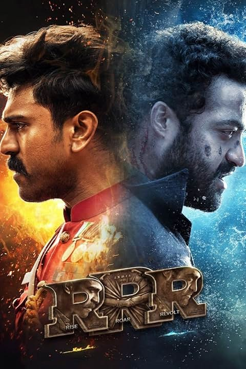

# Prudhvi Chigurupati

## My Favorite Movie: RRR (2022)

*RRR* is one of the most electrifying movies I've seen. Directed by S. S. Rajamouli, it is a historical fiction film that explores the fictionalized lives of two legendary Indian revolutionaries, **Alluri Sitarama Raju** and **Komaram Bheem**. What I love about the movie is the **brilliant direction**, **spectacular action sequences**, and the powerful performances by **N.T. Rama Rao Jr.** and **Ram Charan**. The film also has a powerful soundtrack that perfectly complements the grand scale of the movie. The storytelling keeps you at the edge of your seat, and the emotional depth of the characters makes it a must-watch.

